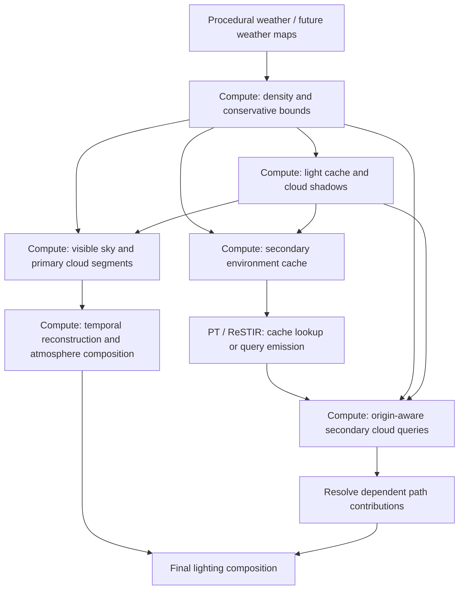

# Cloud system research and proposed architecture

Research date: 7 September 2026. This is a design recommendation, not an implemented or benchmarked renderer.

Implementation update: [Cumulus scene](CUMULUS_SCENE.md) records the first working slice, its RR guides, measurements and limits. The later requirement to use DLSS RR supersedes the separate cloud temporal-reconstruction proposal below: the implementation supplies fresh samples at RR input resolution and lets RR own history.

## Recommendation

Build a planetary procedural density model with local 3D caches, shared lighting caches, and independent compute paths for the visible sky and secondary rays. Use a water-droplet phase function for single scattering and compare inexpensive multiple-scattering models against a real volumetric path-traced reference before choosing the production model.

The strongest fit is a combination of established production techniques and a small, explicit lighting experiment. No source reviewed demonstrates this entire combination, with dynamic global weather and all reflection/diffuse work, in 1–2 ms on an RTX 5090. Photographic appearance is the target; agreement with path tracing remains something to measure.

Working performance assumption: 2560×1440 internal rendering, potentially upscaled to 3840×2160. The requested resolution was not yet confirmed when this report was written. The cloud budget includes secondary rendering, maintenance, reconstruction, cloud shadows and additional atmosphere coupling, measured incrementally over the clear-sky renderer.

## What the references require

The three supplied photographs establish useful, different tests:

- **Fair-weather cumulus from the ground:** varied spacing, coherent bases, asymmetric white towers, broad gray undersides and fine broken edges.
- **A nearby growing tower:** a hierarchy of rounded protrusions, strong depth, illuminated rims and gradual changes into bluish shadow. Fine noise alone cannot provide the large-scale structure.
- **A view above a cloud field:** convincing volume from arbitrary directions, deep gaps, shadows between clouds, and detail that survives close inspection.

Our generation should produce both coherent billows and partially evaporated filaments. Uniform edge erosion would give every cloud the same frayed outline. The base, growing top, sheltered interior and dissipating edge need different behavior.

## Research findings

### The supplied Zhihu baseline

The [January 2022 article](https://zhuanlan.zhihu.com/p/457997155) approximates higher scattering orders with a geometric series. Its feedback factor is `f = (sigma_s / sigma_t) * (1 - exp(-D * sigma_t))`, giving a higher-order multiplier `f / (1 - f)`. It assumes spatially uniform scattering conditions and isotropic higher orders; the example uses a 500 m effective radius. The author acknowledges density-dependent brightness artifacts and suggests testing a smoother density signal.

**Assessment:** keep this as an inexpensive comparison mode. A local density and one length scale cannot describe light arriving from neighboring illuminated regions. Near-conservative scattering also makes the gain sensitive as `f` approaches one. Bounding it prevents numerical blowups but does not establish physical accuracy. This is a lighting approximation, not a complete cloud architecture.

### Production rendering: Nubis and Unreal

[Nubis³, SIGGRAPH 2023](https://www.guerrilla-games.com/read/nubis-cubed), is the most relevant production reference reviewed: volumetric shape data, procedural refinement, separate wispy/billowy detail, cached light-path density and accelerated traversal. Its content pipeline uses simulated/authored volumes; our global procedural generator would need its own solution.

I checked the [original slides and notes](https://d3d3g8mu99pzk9.cloudfront.net/AndrewSchneider/Nubis%20Cubed.pdf), including the performance tables. PDF pages 175–183 show 960×540 cloud renders taking 2.2 ms for a ground view and 4.0 ms for the illustrated aerial views. One depth-split example combines 960×540 and 480×270 rendering to reach 2.1 ms. These are Burning Shores/PS5 results, with scene-specific conditions, not native-4K measurements or complete PT cloud-system costs.

[Unreal's volumetric cloud documentation](https://dev.epicgames.com/documentation/unreal-engine/volumetric-cloud-component-in-unreal-engine) provides another practical reference: reduced-resolution reconstruction, adjustable reflection sampling, multiple-scattering octaves and a choice between volume shadow marches and cheaper Beer shadow maps. The latter sacrifice self-shadow accuracy. These controls illustrate useful tradeoffs; they do not prove a particular millisecond target here.

### A better inexpensive phase function

[Jendersie and d'Eon, 2023](https://research.nvidia.com/labs/rtr/approximate-mie/) fit a Henyey–Greenstein/Draine mixture to water-droplet Mie scattering, with analytic evaluation and sampling. Their path-traced comparisons show meaningful appearance differences from ordinary HG mixtures. The close fit concerns the forward region containing about 95% of scattered energy, not 95% accuracy for every image. It omits the weak peaks responsible for fogbows and glories.

**Recommendation:** use this as the leading phase-function candidate for liquid clouds. Precompute coefficients when droplet parameters change. Validate finite-sun-disk integration and angular filtering around the narrow forward peak. This improves the scattering law; it does not supply missing multiple scattering. Ice clouds need a separate optical model rather than reusing the water-droplet fit indiscriminately.

### Newer neural approaches

[Environmental Volumetric Neural Shading of Clouds, HPG July 2026](https://fileadmin.cs.lth.se/graphics/research/papers/2026/environmental_volumetric_neural_shading_of_clouds_for_real_time_rendering/) uses mesh/triplane representations trained from path-traced cloud assets. Its abstract reports times as low as 3.7 ms. The accessible project summary does not establish a comparable 5090 configuration. Its rasterization and asset-training assumptions make it a poor direct fit for arbitrary procedural density queried through compute shaders.

[Disney's Deep Scattering, 2017](https://la.disneyresearch.com/publication/deep-scattering/) predicts illumination from a multiscale spatial descriptor. It remains useful evidence that surrounding cloud structure matters, but its reported seconds-to-minutes rendering is outside this budget. A tiny predictor evaluated during cache updates is a possible later experiment, not a demonstrated shortcut for this project.

### Procedural dynamics and reconstruction

[Stormscapes, SIGGRAPH Asia 2020](https://research.google/pubs/stormscapes-simulating-cloud-dynamics-in-the-now/) connects atmospheric conditions to cloud formation and transitions, with interactive local simulations up to 10×10 km. It is a useful modeling reference, not evidence that global fluid simulation belongs in a 2 ms render budget. Start with meteorologically motivated procedural fields; leave expensive local simulation optional.

[FAST, published 2024](https://arxiv.org/abs/2310.15364), optimizes sampling patterns for the reconstruction filter and demonstrates volumetric ray marching. Compare it with [spatiotemporal blue noise](https://research.nvidia.com/publication/2022-07_spatiotemporal-blue-noise-masks) once our temporal filter exists. Use actual generated sampling textures, not a hash pattern described as blue noise. Neither removes the need for motion handling and history rejection.

## Proposed density and weather model

The following is an engineering proposal synthesized for this renderer, not a claim that one publication implements it.

### Planetary weather contract

Use layered spherical fields, with a cubed-sphere mapping as the initial candidate. Each location supplies physical altitude ranges, cloud amount, liquid/ice content or calibrated extinction, convective strength, stability, wind by altitude and a lifecycle state. Keep multiple simultaneous layers and cloud families. A single interpolated cloud-type number cannot represent cirrus above cumulus above a low deck.

Initially, a deterministic procedural weather provider fills this contract. Later, weather maps or a simulation can supply the same fields without replacing the density renderer. Update broad weather slowly and interpolate state; advection and local evolution still need smooth frame-to-frame motion. Calling this a weather-driven visual model does not imply numerical weather prediction.

Use planet-centered coordinates for shell intersections and altitude. Evaluate detail using stable world-cell identifiers plus small local coordinates, with one shared convention for wind and time. Camera-origin rebasing must not regenerate the weather. Check cube seams, poles, planetary curvature, the horizon and low sun explicitly.

### Shape hierarchy

1. **Weather organization:** fronts, bands, cloud streets, open/closed cells and clear regions at large scales.
2. **Cloud bodies:** deterministic, spatially clustered thermal columns and irregular lobes with shared bases, variable growth and wind shear. Generate descriptors once per relevant cell; do not sum hundreds of primitives at every ray step.
3. **Secondary structure:** correlated rounded lobes and folds linked to the parent body. Preserve large uninterrupted regions so the result does not resemble a uniformly porous sponge.
4. **Boundary structure:** oriented filaments, ragged fragments and local erosion governed by lifecycle, mixing and exposure. Feathering must occupy real volume and vary across the boundary.

Cache coarse body/profile data near the camera and other important query regions. Evaluate only the needed detail bands at sample time. Maintain conservative occupied bounds expanded for all detail displacement; ordinary averaged density mipmaps are not safe empty-space bounds. Filter density detail according to ray footprint and step size, with continuous transitions. Preserve integrated extinction and coverage as detail is removed.

Avoid a dense, high-resolution planet-sized volume. Prototype dense local clipmap levels first, with coarse global fields for distant rendering. Introduce sparse bricks only if measured empty-space savings justify their indirection and update costs. A practical distant model may use height profiles, but it must agree with the local 3D model through their transition zone.

### Cloud families

Use the [WMO Cloud Atlas](https://cloudatlas.wmo.int/en/descriptions-of-clouds.html) as the visual taxonomy. The procedural mechanisms below are proposed implementations, not meteorological definitions.

| Family | Proposed structural mechanism |
|---|---|
| Cumulus humilis/mediocris | Separated thermal clusters, common condensation level, limited vertical growth |
| Cumulus congestus | Deeper hierarchical towers, uneven growth, coherent billows and selective edge breakup |
| Cumulonimbus | Deep convection plus an upper spreading/anvil region; separate liquid/ice treatment and precipitation controls |
| Stratocumulus | Shallow cellular decks, connected lobes, organized gaps and possible wind-aligned streets |
| Stratus/altostratus/nimbostratus | Layer-dominated density with correlated thickness changes and broad optical depth variation |
| Altocumulus/cirrocumulus | Distinct smaller cellular elements or wave bands at their own layer heights |
| Cirrus/cirrostratus | Thin ice-cloud fields, directional filaments, fall streaks and veils |

Implement representative cumulus, stratocumulus and cirrus early. If those three only look like variations of one noise texture, the representation has failed before further presets are added.

## Proposed lightweight lighting

Separate directly scattered sunlight from indirect illumination inside the cloud:

`source(x, v) = sigma_s(x) * [T_sun(x) * L_sun * phase(v, sun) + indirect(x, v)]`

Integrate this with the view-ray transmittance. Treat `L_sun` consistently as the incident, disk-integrated quantity for the directional approximation; compare against finite-disk sampling in the reference. Use physical distance units, stable homogeneous-step integration and nonnegative extinction. Tone mapping must not compensate for incorrect light transport.

**Direct lighting:** build a coarse 3D sun optical-depth cache from the shared density. Add a bounded local correction near detailed boundaries where necessary. Define the split distance so the correction replaces, rather than repeats, the corresponding cached interval. Cache sky visibility and a low-frequency ground contribution separately. Direct-sun visibility at terrain and surface bounces should come from consistent cloud shadow data.

**Multiple scattering:** prototype two modes behind the same interface:

- A cheap octave/geometric-feedback approximation as a measured baseline.
- A coarse spatial indirect-light cache that combines illumination, optical depth and neighborhood transport or escape estimates. Start with scalar irradiance; assess a directional representation if grazing-light errors demand it. Its update can use a fixed small number of transport iterations and temporal reuse.

The second mode is the main research risk. A low-dimensional closure cannot be assumed accurate for arbitrary cloud topology, and a few transport iterations can underfill dense interiors or lag changes. Compare both against converged reference images, including out-of-fit cloud types and sun angles. If spatial transport cannot fit the budget, measure the quality lost by the simpler mode rather than calling it path-tracing quality.

Treat edge darkening and inner brightness as results to reproduce, not unconditional artistic multipliers. A powder term can be retained as an optional comparison, but it should not flatten every dark underside or draw a bright outline around every silhouette.

**Atmosphere coupling:** combine air and cloud transport along the ray in correct depth order. Air in front of a cloud remains visible; air and stars behind it are attenuated. Multiplying a completed whole-ray atmosphere image by one cloud opacity gives incorrect aerial perspective. Use interleaved integration or a demonstrably consistent segment composition. Include cloud attenuation of incident sunlight and maintain one owner for direct sun-disk energy.

## Compute architecture and secondary rays

All density generation, cloud traversal and cloud-light evaluation belong to compute shaders. DXR kernels perform lightweight cache reads or emit query records. Two principal rendering outputs serve the sky and secondary rays; maintenance and reconstruction need additional compute dispatches.

**Visible sky:** trace at a configurable reduced resolution, initially half width and half height of the internal image. Also integrate clouds in front of opaque geometry, terminating at its actual distance. Store premultiplied radiance and transmittance separately, plus useful depth moments and confidence. Reconstruct using geometry depth and cloud motion. Reject stale history on disocclusion, weather edits and lighting changes. Several separated layers cannot be represented perfectly by a single cloud depth.

**Distant secondary rays:** generate a lower-resolution spherical radiance/transmittance cache in compute before its consumers run. Use it for glossy and diffuse misses with an explicit positional validity region. Multiple anchors or altitude levels may be necessary. An angular cache is an approximation to a function of both position and direction; camera-centered sampling is not correct close to clouds.

**Nearby secondary rays:** collect actual origin, direction, footprint, distance bound, output owner and required throughput/PDF state, then evaluate a cheaper cloud traversal in a dedicated compute pass. Batch coherent queries where possible. Capacity must be bounded and overflow must use a recorded fallback, never silently discard light. This path needs measured error and cost thresholds, not an assumption that all misses are interchangeable.

Diffuse miss directions should sample radiance, just like other sampled directions. Do not substitute cosine-convolved irradiance per miss and then apply the diffuse estimator again. A separately integrated irradiance cache is valid only with its own estimator. Similarly, roughness filtering must match the chosen ray-cone or preintegrated estimator and avoid applying the BRDF twice. Keep the direct sun disk separate from low-resolution environment filtering and retain consistent MIS and attenuation.

**Additional scope for flight inside clouds:** terminal miss evaluation alone cannot attenuate a reflected mountain behind a cloud or a path segment that crosses a cloud and hits geometry. Fully general in-cloud transport requires finite-segment queries and dependent path continuation/resolution as well. That scheduling work and its cost must be included if such views are required. The cache architecture permits this extension; a post-process sky overlay does not solve it.

## Fit to the current renderer

These observations were checked against the working tree after removal of the previous cloud system:

- [Renderer.cpp](../rdn/Renderer.cpp) orders the existing sky bake before SHaRC and PT, and the primary atmosphere pass before final shading. Cloud density/light/cache updates must precede every consumer, including training. Deferred secondary results must resolve before dependent reservoirs or training deposits finalize; appending one late pass is insufficient.
- [SkyBakeLayout.h](../shaders/SkyBakeLayout.h) defines a 256×128 sky cache using storage borrowed from SPMIS only in regular PT mode. Allocate cloud resources independently so they also work under ReSTIR.
- [Pass_pt_v8.hlsl](../shaders/Pass_pt_v8.hlsl) currently evaluates bounce misses at camera altitude, while [Pass_raygen_v8.hlsl](../shaders/Pass_raygen_v8.hlsl) uses the bounce origin. That difference becomes material near clouds.
- [Inline_RT_v8.hlsli](../shaders/Inline_RT_v8.hlsli) and [SunSampler_v8.hlsli](../shaders/SunSampler_v8.hlsli) also evaluate environment tails. Route every path, including replay and diffuse/cache training, through the same cloud-environment contract. Preserve existing PDF/throughput accounting.
- [Pass_atmosphere_primary_v8.hlsl](../shaders/Pass_atmosphere_primary_v8.hlsl) currently integrates air to the first surface or atmosphere exit. Its composition must evolve to handle cloud segments in depth order. Retain valid geometry guides; volumetric cloud history needs its own motion/confidence treatment.
- Weather/light-cache versions must participate in history invalidation for SHaRC and reused lighting. Otherwise a moving cloud can leave stale sunlight or skylight in the scene after its visible image has updated.

The relative links above are repository navigation; code locations and pass names are current integration observations, not proposed public UI.

## Performance allocation and proof

These numbers allocate a **2.0 ms target**. They are not predictions or measurements.

| Incremental GPU work | Allocation |
|---|---:|
| Weather, density and occupancy maintenance, amortized | 0.20 ms |
| Sun/indirect-light caches and cloud-shadow updates | 0.30 ms |
| Visible cloud traversal | 0.75 ms |
| Reconstruction and additional atmosphere composition | 0.25 ms |
| Secondary cache, bounded queries and result resolution | 0.35 ms |
| Scheduling/barriers and contingency | 0.15 ms |
| **Total** | **2.00 ms** |

At 1440p internal resolution, half width/height traversal is 1280×720. At native 4K, the same scale becomes 1920×1080: 2.25 times as many rays, before changes in depth and coverage. The 1 ms end of the request is a stretch target or a lower-work quality mode until measurements prove otherwise. Extensive nearby-cloud queries may exhaust the secondary allocation.

Use bounded update work and an explicit cache-refresh policy. Report cold starts, teleports, sun changes and weather changes separately from warm steady state. Do not hide a large update spike behind an amortized average or assume async compute is free on a busy GPU.

Benchmark on the actual 5090 with the rest of the renderer active. Record internal/output resolutions, pass timestamps, full-frame delta with clouds toggled, average and tail latency, occupied sample counts, cache memory/bandwidth, query overflow and cache refresh time. Run ground, horizon, above-cloud and cloud-boundary views; sparse cumulus, overcast and overlapping layers; noon, low sun and backlighting; static shots, fast movement and camera cuts; PT, ReSTIR and SHaRC modes.

## Implementation order and acceptance

1. **Reference and timing harness.** Build an independent high-sample volumetric reference using the same density, atmosphere and optical parameters, with genuine higher-order scattering. Existing surface PT alone is not that reference. Even Unreal distinguishes its default cloud approximation from an explicitly enabled true multiple-scattering mode in its [path-tracer documentation](https://dev.epicgames.com/documentation/en-us/unreal-engine/path-tracer-in-unreal-engine).
2. **One demanding cumulus scene.** Establish the body/detail hierarchy, bounds, traversal, phase model and the two lighting candidates. Evaluate front-lit, side-lit and backlit views before adding weather complexity.
3. **Sky/secondary integration.** Add the independent compute outputs, consistent sun attenuation, diffuse misses and training/replay handling. Validate mirror and rough surfaces, multiple altitudes and true-origin query behavior.
4. **Planetary layers and contrasting cloud families.** Demonstrate cumulus, stratocumulus and cirrus, then extend to towers, anvils and stratiform cases. Validate global seams, origin shifts and transitions.
5. **Motion and performance.** Tune cache updates, ray footprints, temporal reconstruction and quality levels against the full benchmark matrix. Preserve density/lighting consistency while reducing detail.

Accept the lighting model based on matched-exposure reference comparisons, radiance/transmittance error and visible structure in both stills and motion. Measure shape separately: silhouettes, vertical profiles, billow hierarchy, edge breakup and type recognition. A good match to a badly shaped procedural volume does not meet the photographic target.

The key unresolved items are the multiple-scattering quality/cost tradeoff, the spatial validity of secondary caches and worst-case update/query cost. Those deserve prototypes before committing to a large parameter UI or a full weather simulation.
