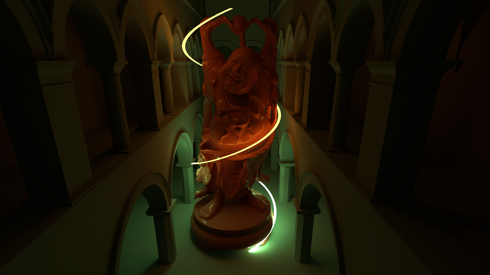
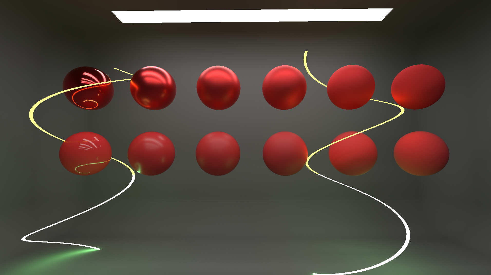
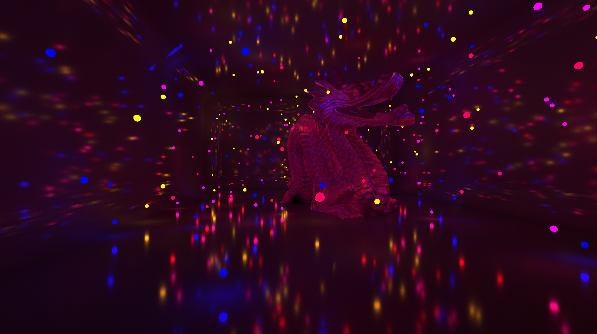
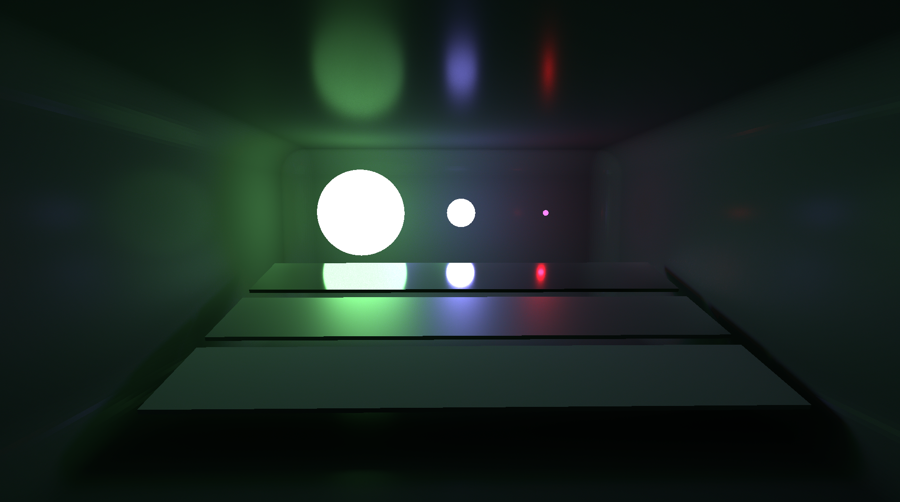

# Royal Tracer DX

A real-time path tracer written in HLSL using the DirectX 12 API.

## Background

What started as a port of the [RoyalTracer university project](https://github.com/Royal-Project-Group/royaltracer) to DirectX quickly became a standalone rendering engine. In my [Bachelor's Thesis](https://ml200.github.io/university/2025/05/28/thesis.html), I implemented and optimized ReSTIR to enhance the renderers' real-time capabilities. Since then, the focus has shifted to implementing and evaluating state-of-the-art algorithms for improving unbiased sampling efficiency.

## Features

### Model Loading
Supports OBJ and glTF/glB formats via [tinyobjloader](https://github.com/tinyobjloader/tinyobjloader) and tiny_gltf v3 loader. Textures are loaded through stb_image with DDS decompression via DirectXTex. Models, materials, and per-instance transforms are unified into a single scene representation.

### Material Model

A four-lobe energy-conserving BXDF with layered evaluation:
- **Sheen** -- Charlie NDF for fabric-like surfaces
- **Clearcoat** -- Dielectric GGX with independent roughness and Fresnel
- **GGX Specular/Transmission** -- Anisotropic microfacet model with VNDF importance sampling, supporting reflection and refraction through nested dielectrics with per-bounce IOR stack tracking
- **Lambertian Diffuse** -- Cosine-weighted base layer

### Light Sampling

A light tree built over the scene's emissive triangles provides efficient importance sampling for many-light environments. The tree uses a TLAS/BLAS hierarchy with precomputed visibility cones and geometric importance weights (receiver cosine, distance attenuation) to guide traversal. This allows the renderer to handle scenes with hundreds of emissive primitives without per-light overhead.

Light tree builds on the cpu. In case of dynamic lights / changes to brighness, the light tree is refit/rebuilt asynchronously

### ReSTIR

Unbiased ReSTIR DI/PT (only reconnection shift mapping) for both direct (DI) and indirect (GI) illumination. Each path uses temporal and spatial reservoir resampling with pairwise MIS for unbiased combination of canonical and neighbor samples. M-capping limits temporal history length. Temporal permutation sampling improves convergence by decorrelating reuse patterns across frames.

### Rendering Pipeline
Path tracer using new HitObj ray tracing with Shader Execution Reordering (SER) for wavefront-like coherence without an explicit wavefront architecture. The pipeline is split into discrete passes:
1. **Raygen** -- Primary rays, multi-bounce path tracing with NEE. Thanks to SER, aggressive russian roulette sampling allows for 30+ bounces with barely any performance impact
2. **Temporal DI/GI** -- Temporal reservoir resampling. Using permutation sampling for temporal neighbor selection to break up temporal correlations that become very appearent in the denoiser.
3. **Spatial DI select + merge** -- Neighbor selection and spatial resampling for DI
4. **Spatial GI select + merge** -- Neighbor selection and spatial resampling for GI. Split neighbor selection pass for better performance / possible extensions to improve neighbor selection later.
5. **Shading** -- Final accumulation, motion vectors, and DLSS input preparation
6. **Post-process** -- Tone mapping (PBR Neutral) and sRGB gamma correction (after denoising)

### Denoiser
NVIDIA DLSS Ray Reconstruction is used for denoising using NVIDIA streamline. On supported GPUs, DLSS frame generation can be used to improve performance.

## Setting up the project

### Requirements
- Windows 11 (recent version for DirectX Agility SDK support)
- NVIDIA RTX 40-series GPU or newer (can possibly run on older HW as well but no guarantee it works due to frame gen)
- Visual Studio 2022 (build tools)

### CLion (2024.3.2 or newer)
1. Set up the toolchain: select Visual Studio (should be auto-detected). Delete any other toolchain.
2. Configure the CMake project: select Visual Studio as the toolchain. Name the build directory `cmake-build-debug-visual-studio`. Select "use default" for the generator and "Release" for build type.
3. Delete the existing `cmake-build-debug-visual-studio` directory if it exists.
4. Reload the CMake project (File > Reload CMake Project).
5. Build and run. Includes are automatically placed in the build directory.

### Visual Studio (2022 or newer)
1. Open the project folder.
2. VS should automatically run CMake.
3. Build and run.
