# Royal Tracer DX


Real-time path tracer in DirectX 12 with unbiased ReSTIR PT on a unified reservoir, a four-lobe layered BXDF, light-tree importance sampling, modern upscaling/denoising technology with NVIDIA DLSS. All images shown are rendered in real-time using DLSS Ray Reconstruction for denoising.

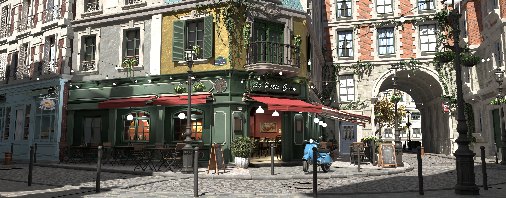

## Table of Contents

- [Features](#features)
- [Background](#background)
- [Build](#build)
- [Controls](#controls)
- [Future Work](#future-work)
- [References](#references)
- [Acknowledgments](#acknowledgments)
- [Gallery](#gallery)

## Features

### Model Loading
Supports OBJ and glTF/glB formats via [tinyobjloader](https://github.com/tinyobjloader/tinyobjloader) and [tinygltf](https://github.com/syoyo/tinygltf). Textures are loaded through stb_image with DDS decompression via [DirectXTex](https://github.com/microsoft/DirectXTex). Models, materials, and per-instance transforms are unified into a single scene representation.

### Material Model

<p float="left">
  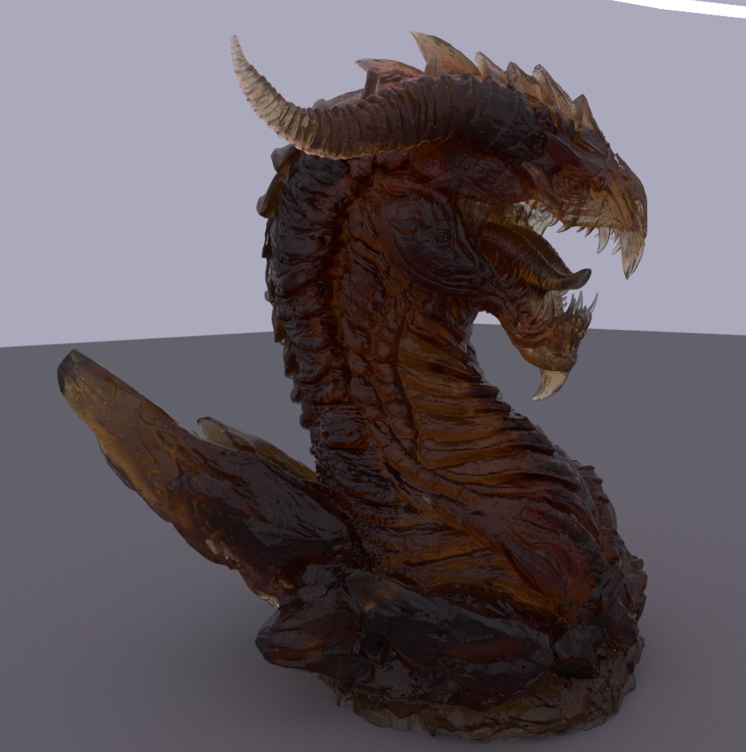
  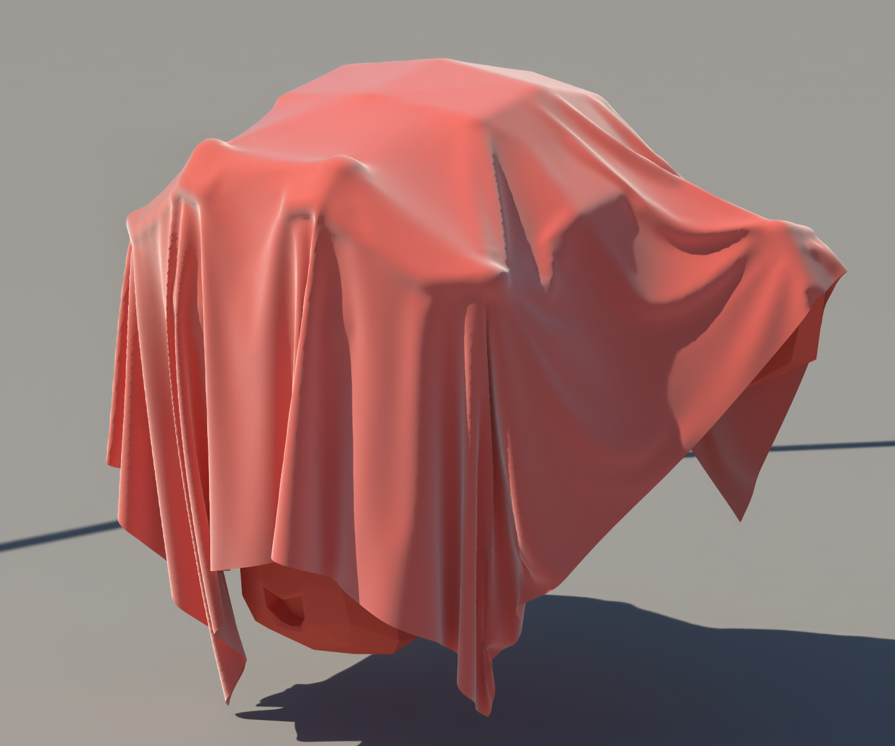
  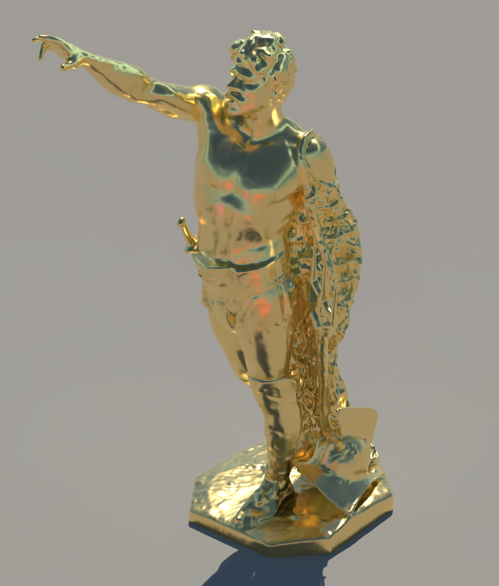
  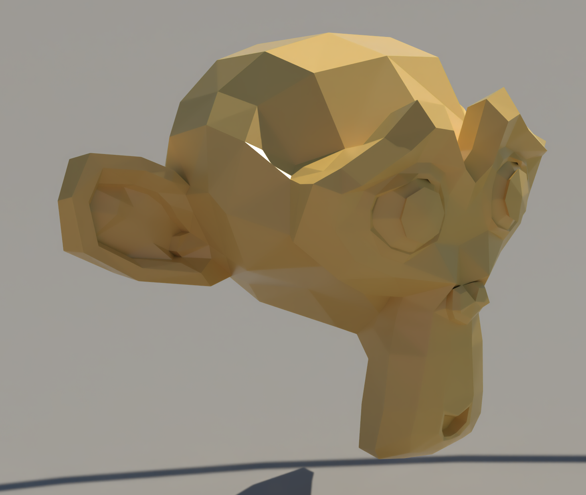
</p>

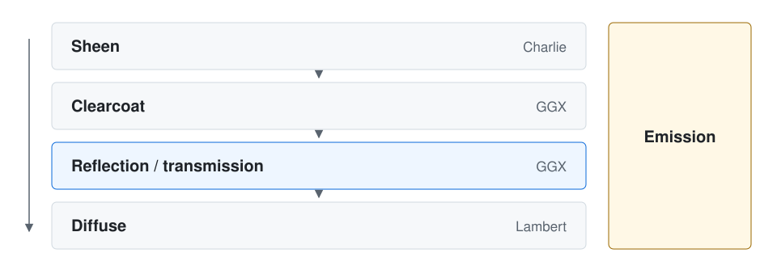

A four-lobe energy-conserving BXDF with layered evaluation:
- **Sheen**: [Charlie NDF](https://blog.selfshadow.com/publications/s2017-shading-course/imageworks/s2017_pbs_imageworks_sheen.pdf) for fabric-like surfaces
- **Clearcoat**: Dielectric GGX with independent roughness and Fresnel
- **[GGX](https://www.cs.cornell.edu/~srm/publications/EGSR07-btdf.pdf) Specular/Transmission**: Anisotropic microfacet model with VNDF importance sampling, supporting reflection and refraction through nested dielectrics with per-bounce IOR stack tracking
- **Lambertian Diffuse**: Cosine-weighted base layer

### Light Sampling

A [light tree](https://fpsunflower.github.io/ckulla/data/many-lights-hpg2018.pdf) built over the scene's emissive triangles provides efficient importance sampling for many-light environments. The tree uses a TLAS/BLAS hierarchy with precomputed visibility cones and geometric importance weights (receiver cosine, distance attenuation) to guide traversal. This allows the renderer to handle scenes with hundreds of emissive primitives without per-light overhead.

Light tree builds on the CPU. When lights move or their brightness changes, the tree is refit/rebuilt asynchronously.

### ReSTIR

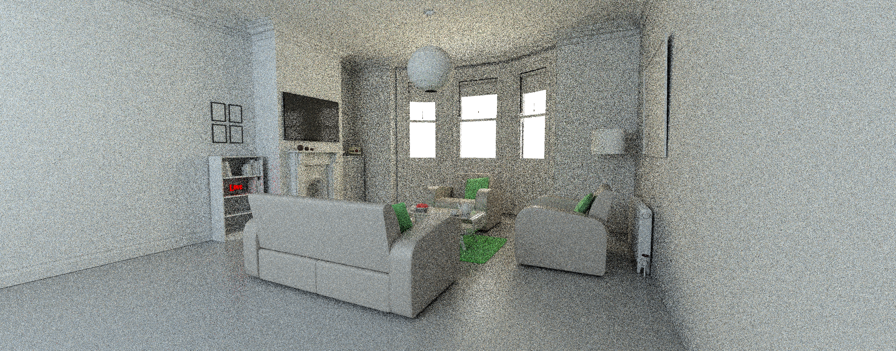
*Path tracing, no ReSTIR (1 spp)*

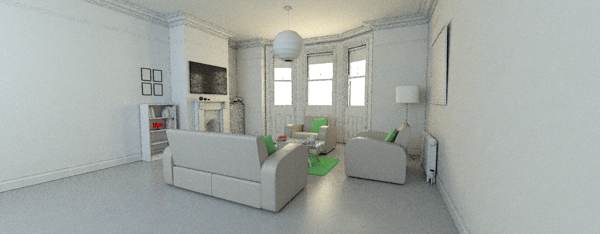
*ReSTIR, raw (1 spp)*

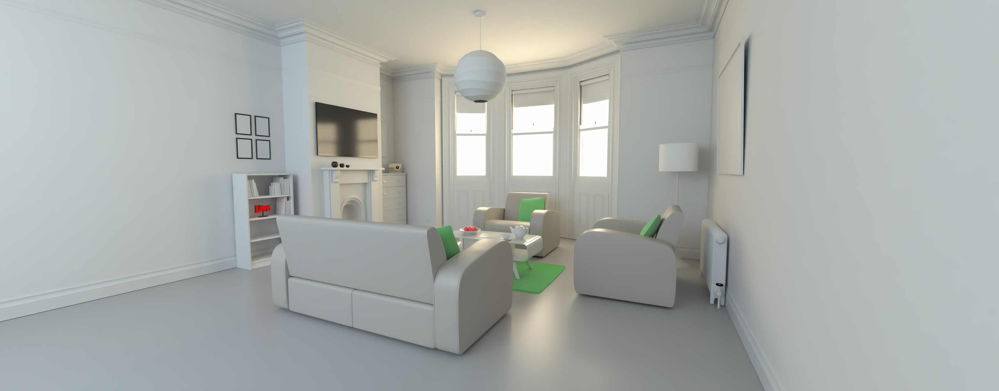
*ReSTIR + DLSS Ray Reconstruction*

Unbiased [ReSTIR PT](https://research.nvidia.com/publication/2022-07_generalized-resampled-importance-sampling-foundations-restir) (reconnection shift only) on a **unified DI/GI reservoir**: NEE, environment miss, and path-integrand candidates all feed one reservoir stream, with sentinel matIDs discriminating direct samples from indirect ones. Each path uses temporal and spatial reservoir resampling with [pairwise MIS](https://intro-to-restir.cwyman.org/) for unbiased combination of canonical and neighbor samples. Temporal permutation sampling decorrelates reuse patterns across frames, and the temporal mCap is modulated by a per-pixel **duplication map** so highly-shared samples refresh quickly instead of creating correlation artifacts (Lin et al. 2026 §5).

### Rendering Pipeline
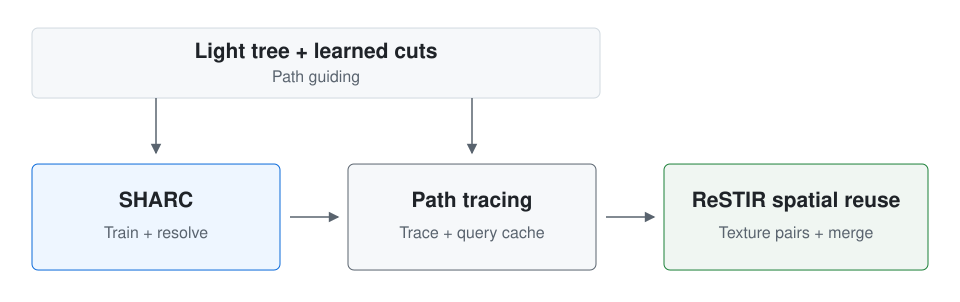

The path tracer uses the DXR HitObject API with Shader Execution Reordering (SER) for wavefront-like coherence without an explicit wavefront architecture. The pipeline is split into discrete passes:
1. **Raygen**: Primary rays, multi-bounce path tracing with NEE. All candidates (NEE, env miss, path integrand) are written into a single **unified DI/GI reservoir**, keyed by sentinel matIDs. Thanks to SER, aggressive russian roulette sampling allows for 30+ bounces with barely any performance impact
2. **Temporal reuse**: Pairwise-MIS temporal resampling on the unified reservoir. Permutation sampling breaks up temporal correlations that become very apparent in the denoiser; the temporal mCap is adaptively lowered where the previous frame's duplication map shows high sample reuse
3. **Reuse-texture partner select**: A stack of three precomputed self-inverting **reuse textures** (Lin, Kettunen, Wyman 2026 §3) gives every pixel a guaranteed-symmetric spatial partner in a single texture load, replacing the usual neighbor-search pass
4. **Spatial shift** (raygen): Performs the reconnection shift and visibility rays for each partner slot, caching the shifted contribution F and Jacobian in per-pixel scratch
5. **Spatial merge** (compute): Pairwise-MIS over the cached shifts
6. **Duplication map**: Compute pass that scans each pixel's 17×17 neighborhood and counts matches of the packed V2 (reconnection-vertex) identifier. Initially presented for Hybrid shift using seed, V2 prooved to be a cheap and simple proxy to distinguish samples in non hybrid-shift environments.
7. **Shading**: Final accumulation, motion vectors, and DLSS input preparation
8. **Post-process**: Tone mapping (PBR Neutral, currently disabled) and sRGB gamma correction

### Opacity Micro-Maps
Alpha-tested geometry (foliage, fences, etc.) uses [Opacity Micro-Maps](https://github.com/NVIDIA-RTX/OMM) (OMMs) built with the NVIDIA OMM SDK. OMMs encode per-microtriangle opacity into the BVH, allowing the hardware to skip transparent regions during traversal without invoking any-hit shaders, significantly improving ray tracing performance on scenes with heavy alpha-tested content.

### Denoiser
NVIDIA DLSS Ray Reconstruction is used for denoising using NVIDIA [Streamline](https://github.com/NVIDIA-RTX/Streamline). On supported GPUs, DLSS frame generation can be used to improve performance.

### Neural Radiance Cache

Following [Müller et al. 2021](https://research.nvidia.com/publication/2021-06_real-time-neural-radiance-caching-path-tracing): a small MLP trained online every frame predicts residual radiance from short path prefixes. Paths terminate at a fixed depth and query the cache for the remainder of the integral. The network runs through [tiny-cuda-nn](https://github.com/NVlabs/tiny-cuda-nn) (tcnn) on a separate CUDA stream alongside the DX12 raster, sharing GPU memory via CUDA-D3D12 interop.

**Network**: fully-fused MLP, 3 hidden × 64 neurons, ReLU activations, linear 3-channel output. 16 raw inputs (position, scattered direction, surface normal, roughness, diffuse + specular reflectance) expand to 74 dims through a composite encoding:

- **Position** → HashGrid, 16 levels × 2 features, log₂ hashmap = 19, smoothstep interpolation
- **Direction & normal** → Spherical Harmonics, degree 4
- **Roughness** → OneBlob, 4 bins
- **Reflectance** → Identity passthrough

**Training**: RelativeL2 loss (Müller 2021 §5) on a *linear* target — sqrt/log target transforms produce systematic darkening through Jensen's inequality. Adam (lr 1e-3, β = 0.9 / 0.99, L2 reg 1e-6), 2 batches × 8192 records per frame. **One row per path** at a randomized depth — multi-row-per-path emission produces intra-path correlated gradients that Adam's 2nd-moment EMA absorbs, collapsing the effective learning rate on shared parameters. 1/16 of training pixels take long RR-terminated paths to anchor emitter/miss radiance; the remainder use cache-recursive multi-bounce targets.

**Engineering**: tcnn lives behind a thin C++/CUDA wall in [Pathtracer/rdn/NRC/](Pathtracer/rdn/NRC/); DXR/HLSL only ever sees the byte-for-byte buffer layout in `NrcLayout.h`, mirrored in `Nrc_v8.hlsli`. An auxiliary CUDA stream + events keep training off the render-critical path, and an adaptive training tile size (4×4 to 32×32 per frame) keeps the trainer saturated independent of resolution.

## Background

What started as a port of the [RoyalTracer university project](https://github.com/Royal-Project-Group/royaltracer) to DirectX quickly became a standalone rendering engine. In my [Bachelor's Thesis](https://ml200.github.io/university/2025/05/28/thesis.html), I implemented and optimized ReSTIR to enhance the renderers' real-time capabilities. Since then, the focus has shifted to implementing and evaluating state-of-the-art algorithms for improving unbiased sampling efficiency.

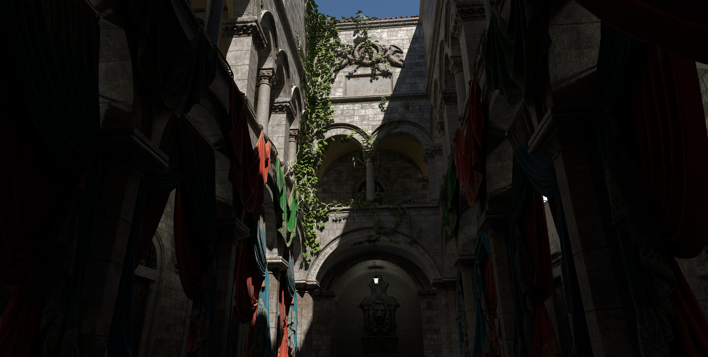

## Build

### Requirements
- Windows 11 (recent version for DirectX Agility SDK support)
- NVIDIA RTX 40-series GPU or newer. Frame generation requires 40-series; core rendering may work on earlier RTX cards but is untested.
- Visual Studio 2022 build tools

### Quickstart

```bash
cmake -B build -G "Visual Studio 17 2022" -DCMAKE_BUILD_TYPE=Release
cmake --build build --config Release
```

<details><summary>CLion (2024.3.2+) setup notes</summary>

1. Set up the toolchain: select Visual Studio (should be auto-detected). Delete any other toolchain.
2. Configure the CMake project: select Visual Studio as the toolchain. Name the build directory `cmake-build-debug-visual-studio`. Select "use default" for the generator and "Release" for build type.
3. Delete the existing `cmake-build-debug-visual-studio` directory if it exists.
4. Reload the CMake project (File > Reload CMake Project).
5. Build and run. Includes are automatically placed in the build directory.

</details>

<details><summary>Visual Studio (2022+) setup notes</summary>

1. Open the project folder.
2. VS should automatically run CMake.
3. Build and run.

</details>

## Controls

| Input | Action |
| --- | --- |
| **W / A / S / D** | Move forward / left / back / right |
| **Space** | Ascend |
| **Left Ctrl** | Descend |
| **Left mouse drag** | Look around |

## Planned Features

- Port NRC to DX12 cooperative vector intrinsics (latest Agility SDK preview) to remove the CUDA dependency
- Modular material system and light sampling for reduced register pressure in callable shaders
- Modular resampling for better performance
- Volume rendering

## References

- Kulla, C., Conty Estevez, A. *Importance Sampling of Many Lights with Adaptive Tree Splitting.* HPG 2018. [[PDF]](https://fpsunflower.github.io/ckulla/data/many-lights-hpg2018.pdf)
- Estevez, A., Kulla, C. *Production Friendly Microfacet Sheen BRDF.* SIGGRAPH 2017 Course. [[PDF]](https://blog.selfshadow.com/publications/s2017-shading-course/imageworks/s2017_pbs_imageworks_sheen.pdf)
- Walter, B., Marschner, S. R., Li, H., Torrance, K. E. *Microfacet Models for Refraction through Rough Surfaces.* EGSR 2007. [[PDF]](https://www.cs.cornell.edu/~srm/publications/EGSR07-btdf.pdf)
- Lin, D., Wyman, C., Yuksel, C. *Generalized Resampled Importance Sampling: Foundations of ReSTIR.* ACM TOG 2022. [[Project]](https://research.nvidia.com/publication/2022-07_generalized-resampled-importance-sampling-foundations-restir)
- Wyman, C. et al. *A Gentle Introduction to ReSTIR.* SIGGRAPH 2023 Course. [[Web]](https://intro-to-restir.cwyman.org/)
- Lin, D., Kettunen, M., Wyman, C. *ReSTIR PT Enhanced.* 2026. (§3: paired reuse textures; §5: duplication-map correlation reduction.)
- Müller, T., Rousselle, F., Novák, J., Keller, A. *Real-time Neural Radiance Caching for Path Tracing.* SIGGRAPH 2021. [[Project]](https://research.nvidia.com/publication/2021-06_real-time-neural-radiance-caching-path-tracing)
- Lanz, M. *Real-Time Path Tracing with ReSTIR.* Bachelor's Thesis, 2025. [[Write-up]](https://ml200.github.io/university/2025/05/28/thesis.html)

## Acknowledgments

- **Scenes**: [Amazon Lumberyard Bistro](https://developer.nvidia.com/orca/amazon-lumberyard-bistro) (NVIDIA ORCA), Crytek Sponza
- **NVIDIA libraries**: [DLSS Streamline](https://github.com/NVIDIA-RTX/Streamline), [OMM SDK](https://github.com/NVIDIA-RTX/OMM)
- **Asset loaders & texturing**: [tinyobjloader](https://github.com/tinyobjloader/tinyobjloader), [tinygltf](https://github.com/syoyo/tinygltf), [stb_image](https://github.com/nothings/stb), [DirectXTex](https://github.com/microsoft/DirectXTex)
- **UI**: [Dear ImGui](https://github.com/ocornut/imgui)

## Gallery

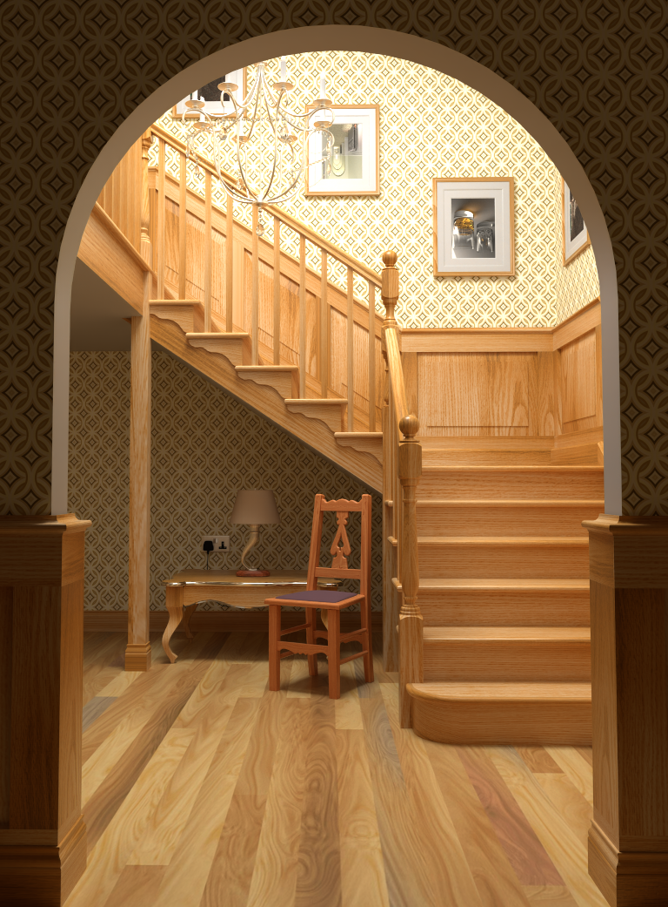

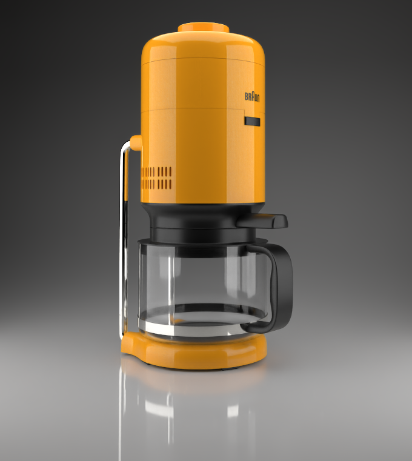

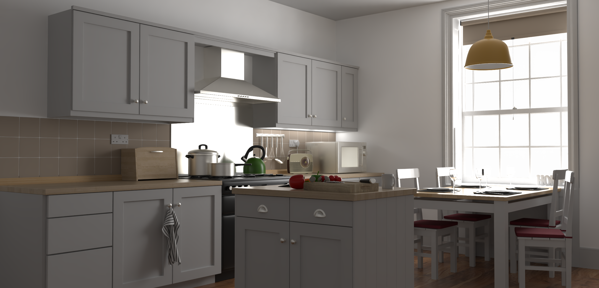

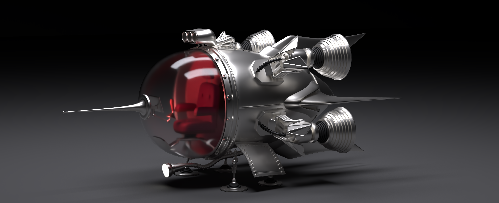
