# Royal Tracer DX


Real time path tracer in DirectX 12 with SHARC radiance caching, path guiding, optimized ReSTIR spatial reuse, a four lobe layered BXDF, light tree importance sampling with learned light cuts, and NVIDIA DLSS for upscaling and denoising.

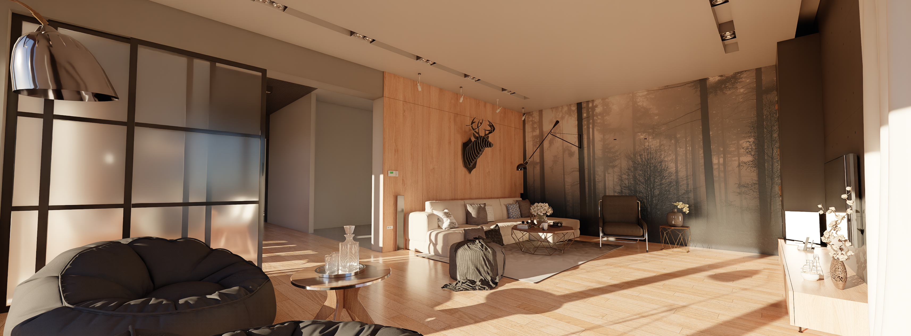

## Table of Contents

- [Features](#features)
- [Background](#background)
- [Build](#build)
- [Controls](#controls)
- [Acknowledgments](#acknowledgments)
- [Gallery](#gallery)

## Features

### Rendering Pipeline


The path tracer uses the DXR HitObject API with Shader Execution Reordering (SER). The regular pipeline consists of three main stages:

1. **SHARC**: Sparse update paths, radiance cache resolve, and path guiding updates.
2. **Path tracing**: Multi-bounce tracing with light tree NEE, learned light cuts, guided BSDF sampling, and SHARC queries.
3. **ReSTIR spatial reuse**: Texture-based partner selection, reconnection and visibility evaluation, followed by pairwise MIS merging.

SHARC training and rendering share the light sampler and material model. Training also updates the directional guide. Spatial reuse operates on the resulting render samples within the current frame.

### Light Trees and Learned Light Cuts

A [light tree](https://fpsunflower.github.io/ckulla/data/many-lights-hpg2018.pdf) over the scene's emissive triangles provides importance sampling for scenes with many lights. The tree uses a TLAS/BLAS hierarchy with geometric importance weights based on emitted power, distance, and orientation.

[Learned light cuts](https://kevincosner.github.io/publications/Wang2021LCR/index.html) adapt emitter selection using visibility-weighted contribution feedback. Spatial cells store cuts of up to 32 clusters, with online splitting and merging. Cells are separated by surface orientation and retain history during camera movement. The learned sampler is used in both path tracing and SHARC training.

### SHARC

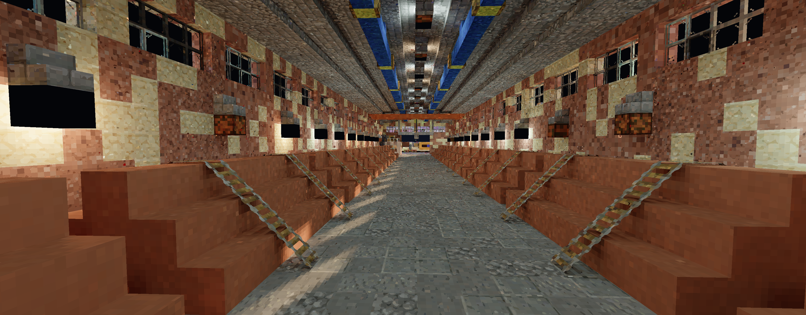

*SHARC example: interior illumination.*

[Spatially Hashed Radiance Caching](https://github.com/NVIDIA-RTX/SHARC) with a sparse world-space hash grid, distance-adaptive cell spacing, and temporal accumulation. A rotating subset of pixels supplies cache updates. Entries store material-demodulated radiance and statistical confidence.

Cache queries replace eligible diffuse and rough reflection contributions at secondary surfaces. Surface identity, normal and plane compatibility, confidence, and path footprint control acceptance. Direct lighting at primary surfaces remains traced, and rejected queries continue normally. Cache termination introduces spatial and temporal approximation error.

### Path Guiding

<table>
  <tr>
    <th width="50%">Path guiding off</th>
    <th width="50%">Path guiding on</th>
  </tr>
  <tr>
    <td valign="top"><a href="media/pg2.webp">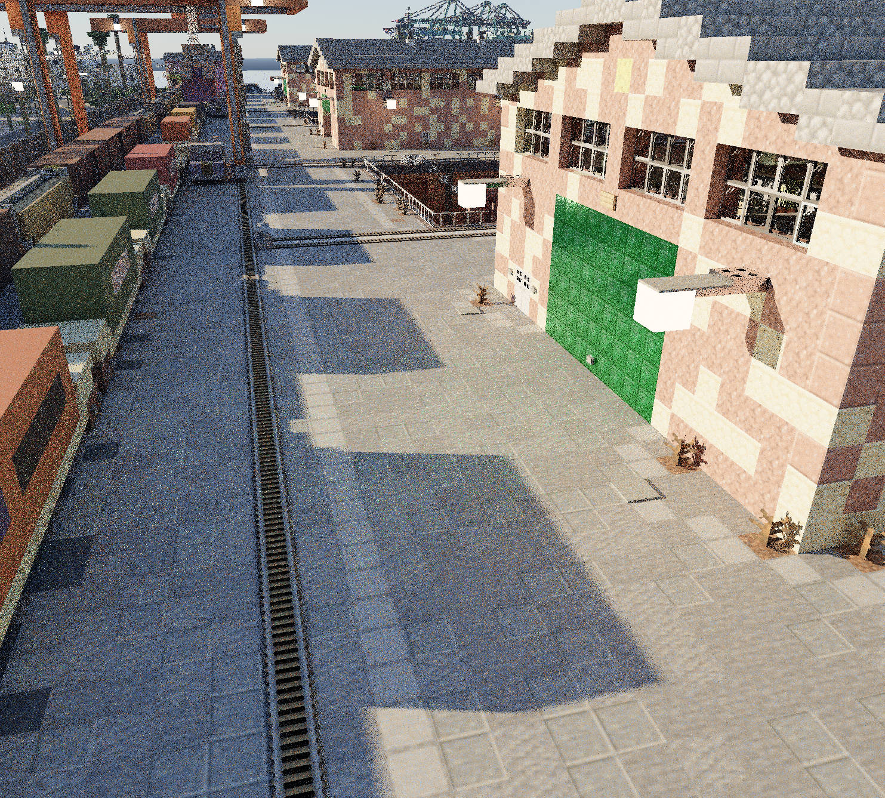</a></td>
    <td valign="top"><a href="media/pg1.webp">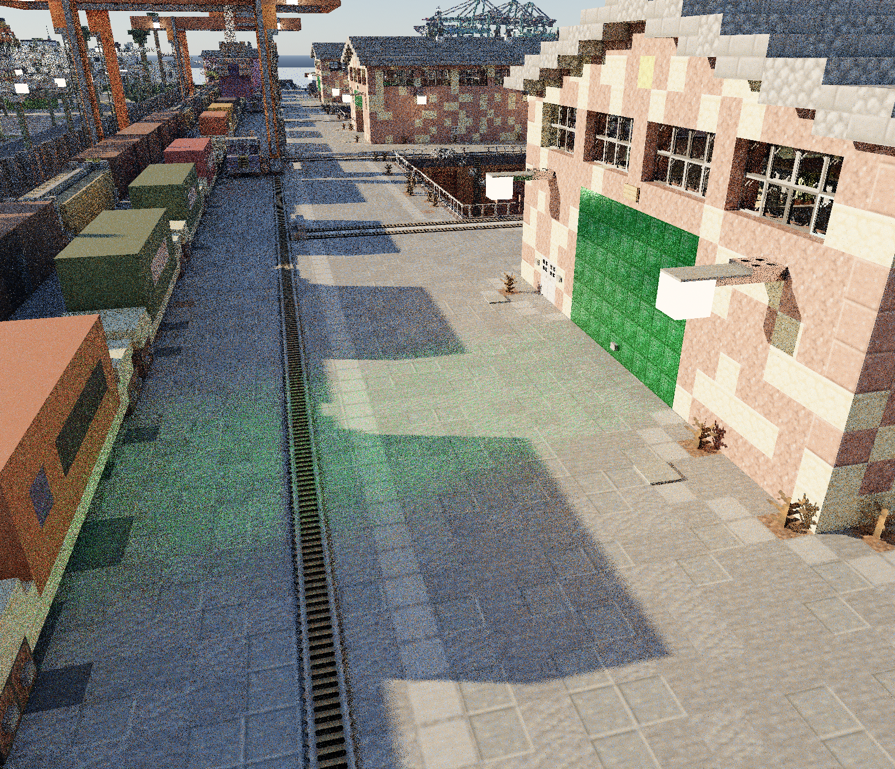</a></td>
  </tr>
</table>

[Path guiding](https://jannovak.info/publications/PathGuide/index.html) uses up to eight directional lobes per spatial cell, fitted from SHARC training paths. Lobes store direction, angular extent, weight, and a distance estimate for parallax correction. Stale lobes decay, with fallback to coarser cells when local support is unavailable.

Guided directions are mixed with diffuse and rough reflection BSDF sampling. The matching mixture PDF is used for path weighting and MIS.

### ReSTIR Spatial Reuse

ReSTIR spatial resampling for diffuse and rough reflection contributions using **32-byte reservoirs**. Three precomputed, self-inverting **reuse textures** provide reciprocal pixel partners, following [ReSTIR PT Enhanced](https://research.nvidia.com/labs/rtr/publication/lin2026restirptenhanced/).

Separate shift and merge passes cache reconnected contributions and visibility for pairwise MIS. Reciprocal pairing makes both pixels' evaluations available to the merge. Repeated samples reuse visibility results, and full neighbor payloads are loaded only on reservoir selection. Material and geometric checks reject incompatible pairs. The regular pipeline uses spatial reuse only.

The ReSTIR PT hybrid shift mode is deprecated.

### Technology Comparison

Cumulative comparison: base path tracing, learned light cuts, SHARC, then path guiding and ReSTIR spatial reuse.

<table>
  <tr>
    <th width="50%">1 · Base path tracing</th>
    <th width="50%">2 · + Learned light cuts</th>
  </tr>
  <tr>
    <td><a href="media/comp1.webp">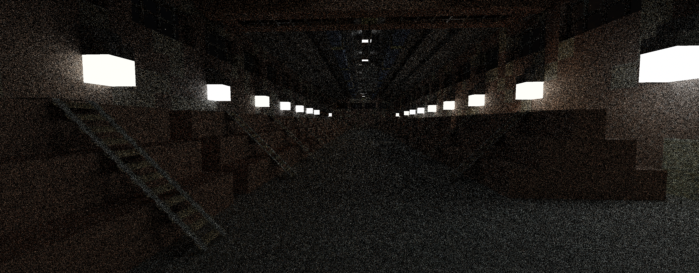</a></td>
    <td><a href="media/comp2.webp">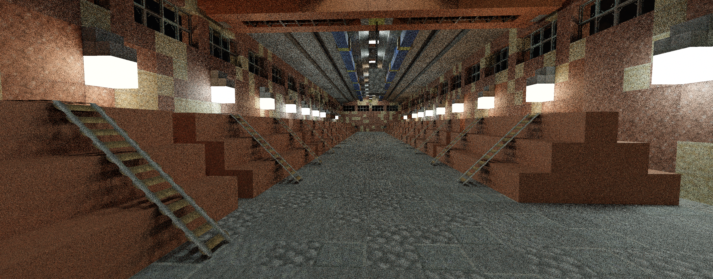</a></td>
  </tr>
  <tr>
    <th>3 · + SHARC</th>
    <th>4 · + Path guiding and ReSTIR</th>
  </tr>
  <tr>
    <td><a href="media/comp3.webp"></a></td>
    <td><a href="media/comp4.webp"></a></td>
  </tr>
</table>

### Material Model

<table>
  <tr>
    <td width="20%" align="center" valign="middle"><a href="media/dragon.png"></a></td>
    <td width="20%" align="center" valign="middle"><a href="media/sheen_clean.png"></a></td>
    <td width="20%" align="center" valign="middle"><a href="media/metal_clean.png"></a></td>
    <td width="20%" align="center" valign="middle"><a href="media/clearcoat_clean.png"></a></td>
    <td width="20%" align="center" valign="middle"><a href="media/sss1.webp">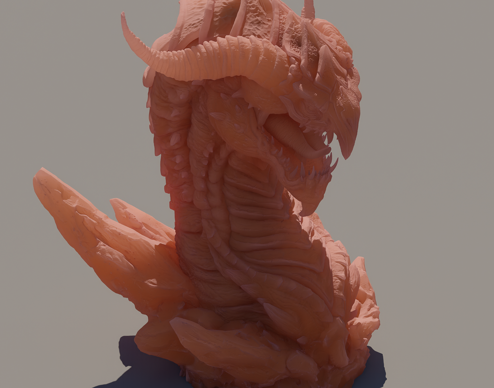</a></td>
  </tr>
  <tr>
    <td align="center">Transmission</td>
    <td align="center">Sheen</td>
    <td align="center">Metal</td>
    <td align="center">Clearcoat</td>
    <td align="center">SSS</td>
  </tr>
</table>

*Material examples, including subsurface scattering (SSS).*


A four lobe BXDF with layered evaluation:

- **Sheen**: [Charlie NDF](https://blog.selfshadow.com/publications/s2017-shading-course/imageworks/s2017_pbs_imageworks_sheen.pdf) for fabric-like surfaces.
- **Clearcoat**: Dielectric GGX with independent roughness and Fresnel.
- **[GGX Specular/Transmission](https://www.cs.cornell.edu/~srm/publications/EGSR07-btdf.pdf)**: Anisotropic microfacet model with VNDF importance sampling. Nested dielectrics use per-bounce IOR stack tracking.
- **Lambertian Diffuse**: Cosine-weighted base layer.

Subsurface scattering uses volumetric random walks. Emission is evaluated separately from the scattering lobes.

### Model Loading

Supports OBJ and glTF/GLB via [tinyobjloader](https://github.com/tinyobjloader/tinyobjloader) and [tinygltf](https://github.com/syoyo/tinygltf). Textures use stb_image with DDS decompression through [DirectXTex](https://github.com/microsoft/DirectXTex). Models, materials, and per-instance transforms share a unified scene representation.

### Opacity Micromaps

Alpha-tested geometry uses [Opacity Micromaps](https://github.com/NVIDIA-RTX/OMM), built with the NVIDIA OMM SDK. Opacity is encoded per microtriangle in the BVH, allowing hardware traversal to skip transparent regions without any-hit shader invocations.

### Denoiser

NVIDIA DLSS Ray Reconstruction provides denoising and upscaling through [Streamline](https://github.com/NVIDIA-RTX/Streamline).

### Minecraft Chunk Rendering

Minecraft worlds are supported with chunk streaming, adaptive LOD, and asynchronous geometry builds. Emissive block geometry is sampled through the light tree.

Example statistics from a recorded **Greenfield v0.5.4** run:

| Metric | Count |
| --- | ---: |
| Rendered triangles | 86.13 million |
| Emissive triangles in the active light tree | 1.29 million |
| World chunks | 295,936 across 356 regions |
| Materials | 10,451 |
| Textures | 5,253 |

Geometry and light counts vary with camera position and LOD.

<!-- Metrics: Pathtracer/out/ui-performance/startup.log, 2026-09-14. World/assets: lines 55 and 68. Rendered triangles and active light-tree triangles: lines 155 and 157. -->

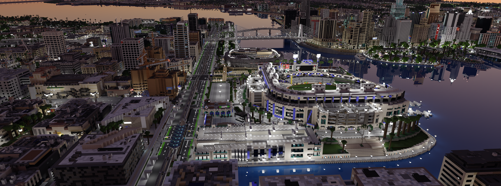

## Background

What started as a port of the [RoyalTracer university project](https://github.com/Royal-Project-Group/royaltracer) to DirectX became a standalone rendering engine. In my [Bachelor's Thesis](https://ml200.github.io/university/2025/05/28/thesis.html), I implemented and optimized ReSTIR to improve real time rendering. Current work focuses on learned sampling, radiance caching, and spatial reuse.

## Build

Requires Windows 11, an NVIDIA RTX 40 series GPU or newer, Visual Studio 2022 with C++ build tools and Windows SDK 10.0.22621.0, and CMake 3.25.2 or newer.

Run from the repository root:

```powershell
cmake -S Pathtracer -B Pathtracer/build -G "Visual Studio 17 2022" -A x64
cmake --build Pathtracer/build --config Release
```

## Controls

| Input | Action |
| --- | --- |
| W / A / S / D | Move |
| Space / Left Ctrl | Ascend / descend |
| Left mouse drag | Look around |

## Acknowledgments

- **Scenes**: [Amazon Lumberyard Bistro](https://developer.nvidia.com/orca/amazon-lumberyard-bistro) (NVIDIA ORCA), Crytek Sponza, Minecraft Greenfield.
- **NVIDIA libraries**: [Streamline](https://github.com/NVIDIA-RTX/Streamline), [OMM SDK](https://github.com/NVIDIA-RTX/OMM).
- **Asset loaders and texturing**: [tinyobjloader](https://github.com/tinyobjloader/tinyobjloader), [tinygltf](https://github.com/syoyo/tinygltf), [stb_image](https://github.com/nothings/stb), [DirectXTex](https://github.com/microsoft/DirectXTex).
- **UI**: [Dear ImGui](https://github.com/ocornut/imgui).

## Gallery

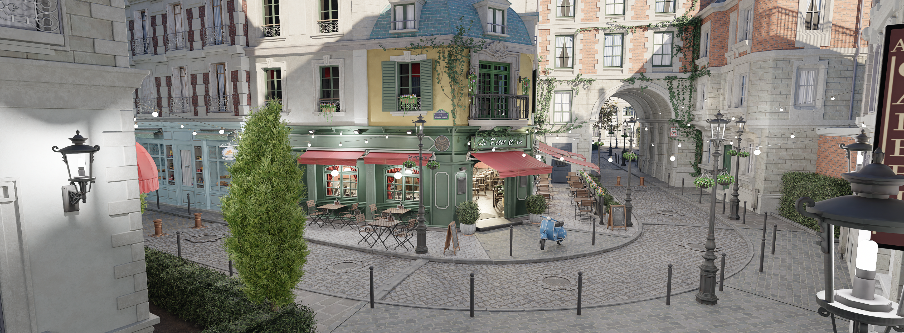

*Bistro.*

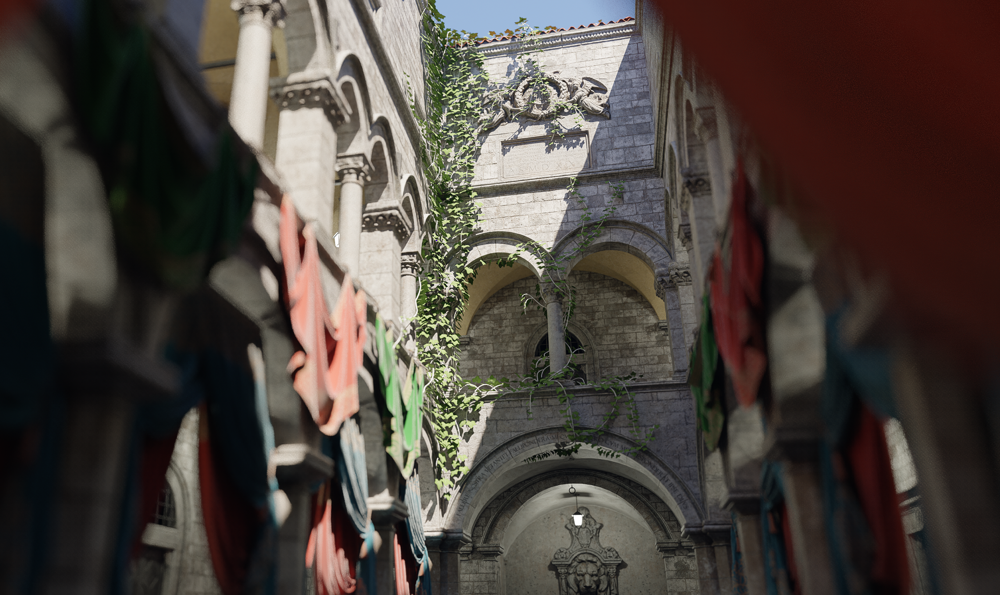

*Sponza.*

<table>
  <tr>
    <td width="50%"><a href="media/harbor2.webp">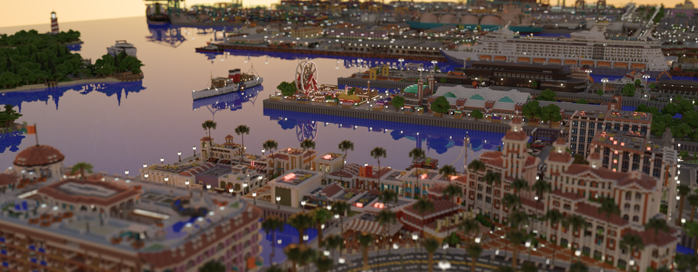</a></td>
    <td width="50%"><a href="media/harbor3.webp">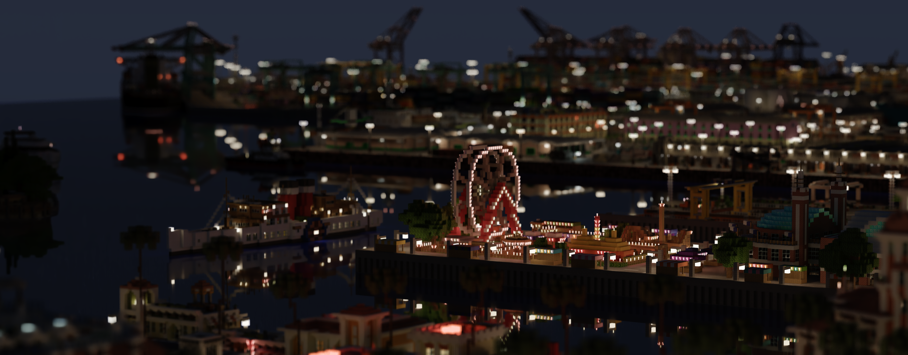</a></td>
  </tr>
  <tr>
    <td align="center">Harbor</td>
    <td align="center">Harbor at night</td>
  </tr>
  <tr>
    <td><a href="media/ship2.webp">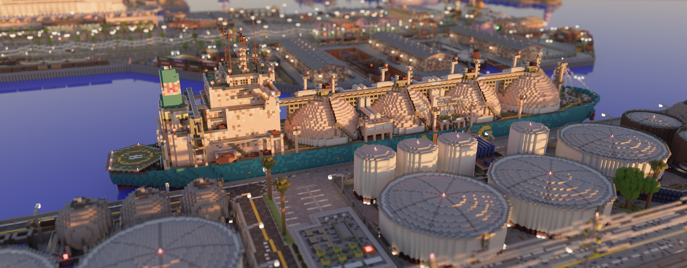</a></td>
    <td><a href="media/skyline.webp">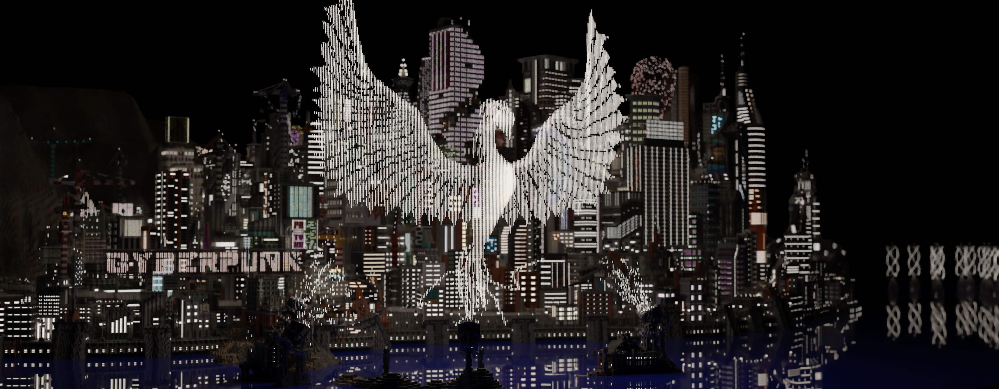</a></td>
  </tr>
  <tr>
    <td align="center">Ship</td>
    <td align="center">Skyline</td>
  </tr>
</table>

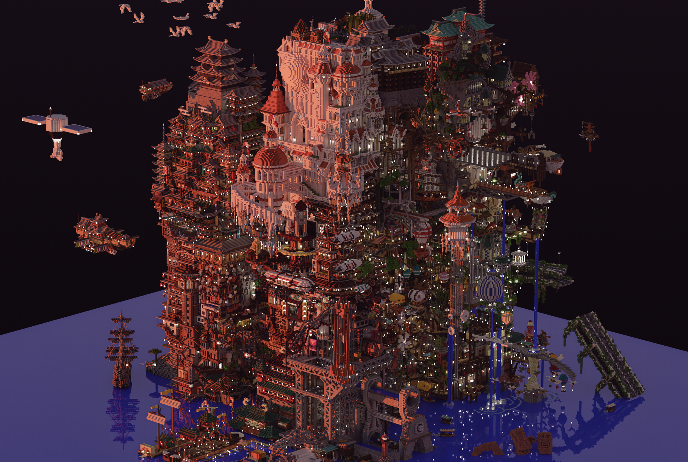

*Island.*
